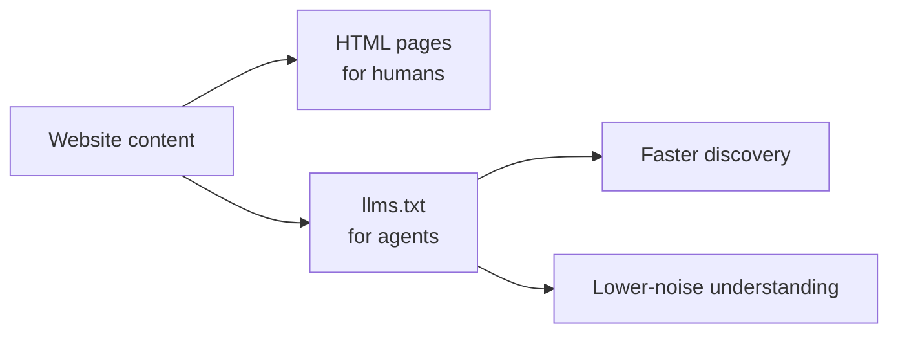

# From SEO to AEO: Why Agent DX is Rewriting How We Design Content

## TL;DR

傳統 SEO 是讓「搜尋引擎找到你」，  
AEO（Answer Engine Optimization）是讓內容更容易被 AI 理解、抽取、整合與引用。

而 llms.txt，可以把它看成這個轉變中一種早期的「Agent-friendly discovery hint」。

---

## Problem

過去 20 年，網路內容設計的核心是：

> Human-first discovery

- 內容寫給人看
- 搜尋引擎負責索引與排序
- 使用者點擊 → 閱讀 → 自行整理答案

但 AI 搜尋改變了這件事：

> 使用者不再找「頁面」，而是直接要「答案」

這導致新的系統需求：

- 可理解（understandable）
- 可抽取（extractable）
- 可引用（citable）

👉 問題不是 HTML 無法承載內容，而是多數網頁對 AI 抽取並不是理想介面

---

## Context: SEO → AEO

### SEO

- 單位：Page
- 目標：Ranking
- 成功指標：Clicks

---

### AEO（Answer Engine Optimization）

AEO 的核心是：

> 將內容設計成「可被 AI 直接使用作為答案」 [AEO 定義][aeo-core]

更精確地說：

> 它不是取代 SEO，而是增加一個新的優化面向：讓內容更容易進入 AI answer pipeline

也就是：

- AI 能理解
- AI 能抽取
- AI 更容易整合，並在支援引用時納入來源

👉 本質轉變：

| 面向       | SEO   | AEO             |
| ---------- | ----- | --------------- |
| 目標       | 排名  | 成為答案        |
| 單位       | Page  | Knowledge chunk |
| 使用者行為 | Click | No-click        |
| 成功指標   | 流量  | 被引用          |

👉 SEO 與 AEO 的差別：

> 從「被找到」→「被使用」

---

## Why AEO Emerges

### 搜尋變成 Answer Engine

現代搜尋系統：

- 理解問題
- 整合多來源
- 直接生成答案

👉 搜尋正在從 link list 轉向 answer layer [AEO 轉變][aeo-shift]

---

### 使用者行為改變

- Zero-click search
- 不再瀏覽網站

👉 成功變成：

> 被 AI 引用，而不是被點擊 [AEO 引用][aeo-citation]

---

## llms.txt: The Missing Layer

### llms.txt 是什麼

llms.txt 是：

- 一個放在 `/llms.txt` 的文件
- 提供 AI 可讀內容索引
- 幫助 LLM 理解網站內容

👉 本質：

> 幫助 AI 更有效率理解與使用網站內容的早期提案 [llms-definition][llms-definition]

它比較像：

- 一個 AI-friendly discovery hint
- 一個尚未完全標準化、也尚未被廣泛驗證效果的做法

---

### llms.txt 想解決的問題

LLM 在 web 上的問題：

- HTML 太 noisy
- 無法判斷重要內容
- context window 有限

👉 llms.txt 提供：

- curated content index
- 明確優先順序

但要注意：

- 它不是保證被採用的協議
- 也不是 AI citation 的充分條件

---

### 類比（非常關鍵）

| 機制         | 對象          |
| ------------ | ------------- |
| robots.txt   | crawler       |
| sitemap.xml  | search engine |
| **llms.txt** | AI agent      |

👉 更精準的說法：

> llms.txt 比較像 AI 時代的一個內容 discovery / routing hint [llms-role][llms-role]

---

### 更進一步（這篇的觀點）

> 🔥 llms.txt 可以視為 Agent DX 的 Discovery Layer 之一

---

## AEO as System Design

AEO 不是行銷技巧，而是資訊架構問題

---

### Discovery Layer

- llms.txt
- sitemap

👉 解決：去哪找

---

### Retrieval Layer

- RAG / embedding

👉 解決：找什麼

---

### Representation Layer

- Markdown
- FAQ
- structured content

👉 解決：怎麼理解

---

### Authority Layer

- citation
- entity signals

👉 解決：信不信

---

## Design Principles

### Write for extraction

- 一段回答一個問題

---

### Prefer structure over prose

- 標題清楚
- 條列化

---

### Minimize ambiguity

- 定義明確
- 避免模糊語言

---

### Optimize for citation

- 提供結論句
- summary

---

### Design for chunking

- 每段可獨立引用

---

## Trade-offs

### 👍 優點

- 提升 AI 可見度
- 降低 hallucination
- 提高引用率

---

### 👎 限制

- 尚未標準化
- AI 不一定採用
- 對 SEO 影響有限
- 對 AI citation 的效果仍缺乏穩定證據

👉 有觀點指出：

> llms.txt 目前仍屬 early-stage，效果有限 [llms-risk][llms-risk]

---

## Insight

> 🔥 AEO 是「Content → Interface」的轉變

內容不再只是：

👉 給人閱讀  
而是：

👉 給 AI 使用

---

## llms.txt as an Agent-Friendly Interface

如果 SEO 關心的是：

> search engine 能不能找到你的內容

那從 Agent DX 的角度看，問題是：

> agent 能不能快速理解你的內容

這也是 llms.txt 跟 AEO 真正接起來的地方。

它的重要性不在於取代 HTML，
而在於提供一個對 agent 更友善的內容入口。

因為大多數 HTML 頁面對 agent 來說：

- 太 noisy
- 太依賴版面與導覽
- 不容易快速判斷哪些內容最重要

而 llms.txt 的價值在於：

- 提供更低噪音的內容索引
- 降低 discovery 成本
- 幫助 agent 更快定位可用內容

👉 所以 llms.txt 不只是 AEO tactic，

它更像是把網站內容包裝成一個更 agent-friendly 的 interface。

---

## Conclusion

AEO 不是 SEO 的替代，而是進化：

- SEO：讓人找到你
- AEO：讓 AI 使用你

而 llms.txt：

> 👉 比較像是這個轉變中的第一個可實驗入口，而不是已定型的標準答案

---

## References

- [Answer Engine Optimization — Conductor Academy][aeo-core]
- [AEO: Evolving Your SEO Strategy in the Age of AI Search — Amsive][aeo-citation]
- [Answer Engine Optimization (AEO): The Comprehensive Guide — CXL][aeo-shift]
- [What is llms.txt? — AIOSEO][llms-definition]
- [How llms.txt Supports Answer Engine Optimization — Artversion][llms-role]
- [llms.txt: What It Is and Why It Matters — Webflow][llms-risk]

[aeo-core]: https://www.conductor.com/academy/answer-engine-optimization/
[aeo-citation]: https://www.amsive.com/insights/seo/answer-engine-optimization-aeo-evolving-your-seo-strategy-in-the-age-of-ai-search/
[aeo-shift]: https://cxl.com/blog/answer-engine-optimization-aeo-the-comprehensive-guide/
[llms-definition]: https://aioseo.com/what-is-llms-txt/
[llms-role]: https://artversion.com/blog/how-llms-txt-supports-answer-engine-optimization-aeo/
[llms-risk]: https://webflow.com/blog/llms-txt
