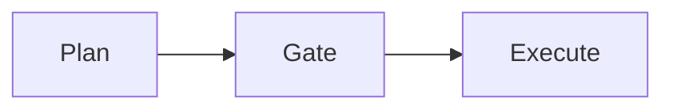
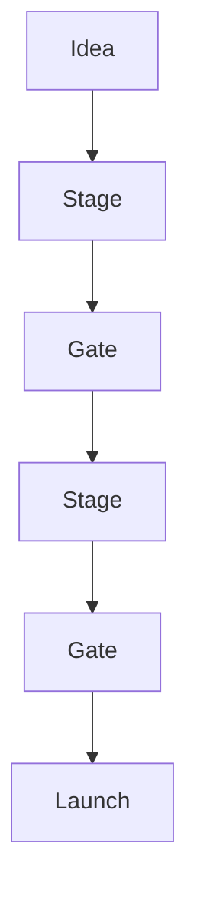
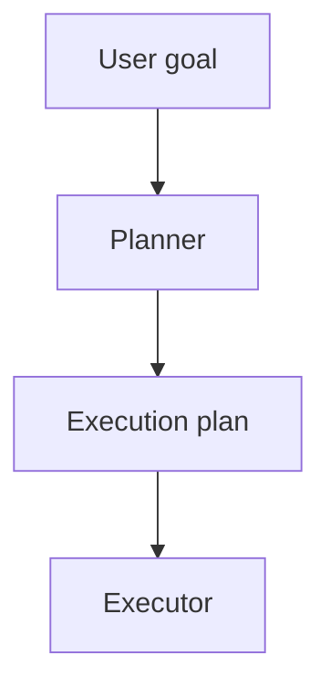
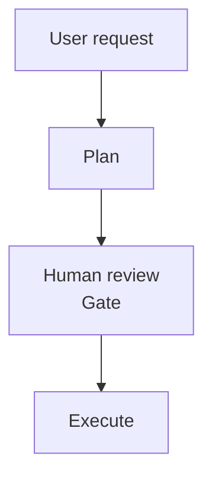
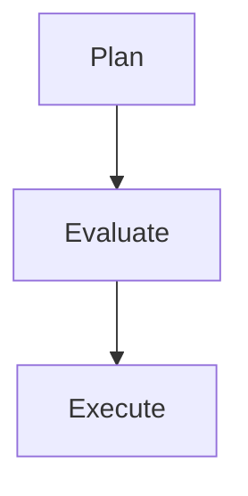
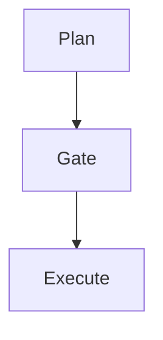

# Plan-Gate-Execute

最近在各種 AI coding agent 或 automation workflow 中，常常看到一個共同的模式：

先規劃，再審查，最後執行。

這看起來像是 AI agent 時代才出現的設計模式，但如果回顧軟體工程與企業管理的歷史，會發現它其實早已存在。

在產品開發與創新管理領域，這個概念有一個非常成熟的名字：**Stage-Gate**

---

## Stage-Gate：企業產品開發的治理框架

Stage-Gate 是創新管理學者 **Robert G. Cooper** 在 1980 年代提出的一種產品開發方法。
這個模型將產品開發流程拆成多個 **Stage（階段）**，並在每個階段之間設置 **Gate（決策點）**。 ([Toolshero][1])

簡單來說：

- **Stage**：完成一組工作與產出
- **Gate**：決定是否繼續投資

典型流程如下：

在 Gate 階段，決策者會評估專案的進展，例如：

- 技術可行性
- 商業價值
- 投資報酬
- 專案風險

根據評估結果，專案可能會：

- **Go**：進入下一階段
- **Kill**：終止專案
- **Rework**：回到前一階段修正

Stage-Gate 的核心目的，是在產品開發過程中 **逐步投入資源並控制風險**。
這個模型將創新流程拆成多個階段，每個階段結束時透過 gate review 決定是否繼續推進專案。 ([IPBA® Connect][2])

這種治理方式在製造業與產品開發領域被廣泛採用，成為企業管理創新與新產品開發的常見框架。

---

## AI Agent 為什麼重新強調 Plan

如果把 Stage-Gate 的概念抽象化，可以得到一個更簡單的結構：

而這正是近年 AI agent 架構逐漸形成的共識。

在早期的 LLM agent 設計中，常見模式是 **ReAct（Reason + Act）**：
模型在每一步同時進行推理與工具呼叫。

但當任務變得複雜時，這種模式往往：

- 推理成本高
- context 容易污染
- 多步驟任務不穩定

因此在 2023 年，LangChain 社群提出了 **Plan-and-Execute agents**。
這種架構將 **規劃（planning）與執行（execution）分離**：先生成任務計畫，再逐步執行子任務。 ([LangChain Blog][3])

典型流程如下：

這種設計的優點包括：

- 任務可以被拆解為可控的子步驟
- 降低 agent 推理迴圈的成本
- 提升複雜任務的穩定性

換句話說，Agent 不再是 **邊想邊做**，而是 **先想好再做**。

---

## Google Gemini CLI 的 Plan Mode

隨著 agent 開發工具成熟，「先規劃再執行」的設計也開始進入主流開發工具。

例如 Google 在 **Gemini CLI** 中推出了 **Plan Mode**。
在這個模式下，AI 會先分析程式碼與系統架構，再提出修改策略，而不是直接修改檔案。

典型 workflow：

在 Plan Mode 中，AI 可以：

- 閱讀程式碼
- 分析依賴關係
- 理解系統架構
- 提出修改策略

但 **不能直接修改檔案**。

這其實是在 coding workflow 中顯式加入 **planning 階段**，讓開發者可以在執行前先審查策略。

---

## Plan-Gate-Execute：一個跨領域的模式

如果把視角拉高一點，會發現很多領域其實都在使用同一種結構。

| 領域      | 對應模式          |
| --------- | ----------------- |
| 產品開發  | Stage-Gate        |
| 專案管理  | Phase-Gate        |
| 投資決策  | Staged investment |
| AI Agents | Plan-and-Execute  |

本質上它們都在做同一件事：

或更完整地說：

Stage-Gate 提供的是 **企業治理框架**。
而 AI Agent 只是把這個概念搬到了 **軟體系統與 automation workflow** 中。

---

## 總結

Plan-Gate-Execute 看起來像是 AI agent 的新設計模式，但其實它只是把一個成熟的管理思想重新應用在工程系統中。

從產品開發到 AI coding agent，這些系統都在解決同一個問題：

**如何在不確定環境中做出更好的決策。**

而答案往往非常簡單：

> **先思考，再行動。**

---

## 參考資料

- Robert G. Cooper — Stage-Gate innovation model
- Stage-Gate Process overview
- LangChain Blog — _Plan-and-Execute Agents_
- Google Developers Blog — _Plan Mode is now available in Gemini CLI_

[1]: https://www.toolshero.com/innovation/stage-gate-process/?utm_source=chatgpt.com "Stage Gate Process by Robert Cooper explained - Toolshero"
[2]: https://profwurzer.com/glossary/stage-gate-process/?utm_source=chatgpt.com "Stage-Gate-Process"
[3]: https://blog.langchain.com/plan-and-execute-agents/?utm_source=chatgpt.com "Plan-and-Execute Agents"
